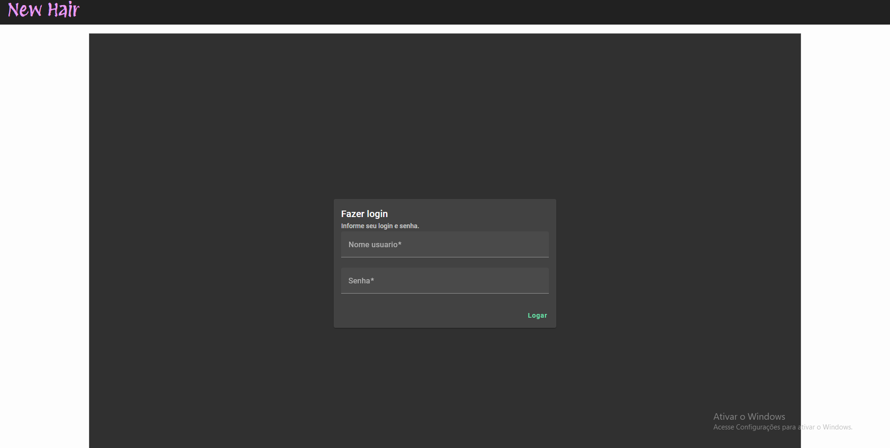

# Authentication API

API responsável pelo gerenciamento de clientes.

## Visão geral

Esta API foi desenvolvida em C# utilizando o framework .NET Core. Ela fornece funcionalidades para gerenciamento de usuários, roles e login utilizando JWT, utilizando DDD e TDD para garantir robustez no sistema.

## Uso da API

Para criar um usuário que permita fazer login é super simples. Basta enviar uma solicitação POST para `/api/Usuarios` com as informações de usuário e senha. Para fazer login em alguma API, é necessário criar roles, o que pode ser feito pelo POST em `/api/Usuarios`, informando o nome da Role desejada. Por fim, no recurso POST em `/api/Usuarios/{uuid}/Roles`, você informa o `uuid` do seu usuário e, no array solicitado, a lista de roles escolhidas.
Nota: No README das aplicações é possível encontrar a role necessária:

- [Cliente API](https://github.com/NielDevSft/cliente)
- [Empresa API com a aplicação em Angular que implementa esta API de autenticação](https://github.com/NielDevSft/empresa)

## Pré-requisitos

- Docker na versão mais atual.

## Instalação

1. Clone este repositório.
2. Dentro da pasta raiz do projeto, execute o comando `docker-compose up --build --remove-orphans -d`.
3. Acesse [Authentication API](http://localhost:5002/index.html).

## Contribuição

Contribuições são bem-vindas! Se você quiser contribuir com este projeto, por favor siga estas etapas:

1. Faça um fork do repositório.
2. Crie uma branch para a sua feature (`git checkout -b feature/MinhaFeature`).
3. Faça commit das suas mudanças (`git commit -am 'Adicione uma nova feature'`).
4. Faça push para a branch (`git push origin feature/MinhaFeature`).
5. Abra um Pull Request.

## Autor

[Daniel da Silva Figueiredo](https://github.com/NielDevSft) - Desenvolvedor FullCycle.

## Aplicação que faz uso desta API

[Aplicação em Angular](https://github.com/NielDevSft/empresa)

